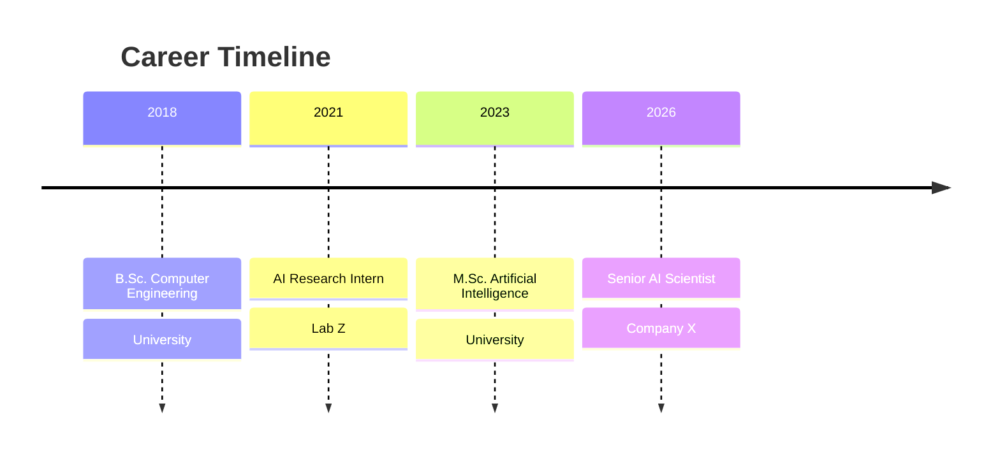

# Mahriar Gharaghani  
Python Developer | AI & ML | Automation | Backend Systems
Tehran, Iran  
mahriargharaghani@gmail.com | +98 917 397 8579

1378 / 03 / 17

---

```fa
2018     2021     2023      2026
|---------|---------|---------|
B.Sc      Intern    M.Sc.     Senior AI Scientist
CE        Lab Z     AI        Company X
```



---

## Professional Summary

Python developer with hands-on experience across **backend-oriented applications, automation workflows, data-driven decision tools, and AI systems**. Combines an engineering background, practical product and operations experience, and applied research in **reinforcement learning, robotics simulation, and LLM-assisted workflows**.

Well-suited for **Python developer, backend Python, data-focused Python, and AI application engineering roles** because of a mix of:

- production-minded software development
- analytical and reporting depth
- research-oriented problem solving
- cross-functional product and delivery experience

Currently completing an **M.Sc. in Engineering Management at Iran University of Science and Technology**, where the thesis focuses on an **autonomous budgeting AI agent** built with deep reinforcement learning for decision-making under uncertain cashflows.

---

## Technical Skills

### Core Languages
- Python
- JavaScript
- TypeScript
- LaTeX / XeLaTeX

### Python and Backend
- FastAPI
- Flask
- Django
- REST API integration
- Workflow orchestration
- Backend logic and service design
- Data processing and analytical scripting

### Data and Automation
- Data analysis
- Data visualization
- Reporting and decision-support tooling
- KPI and metrics system design
- Process automation
- n8n
- API-based workflow automation

### AI and Applied ML
- Machine learning
- Deep reinforcement learning (DRL)
- Robotics simulation
- Prompt engineering
- RAG-style application workflows
- Local LLM inference workflows
- Model adaptation / fine-tuning concepts

### Additional Engineering Exposure
- Next.js
- Nest.js
- Full-stack architecture
- Cloud cost-aware delivery
- Database-backed application development

---

### freeCodeCamp Full stack Java script WebDev Certifications
Completed multiple freeCodeCamp certification tracks that strengthened practical software development fundamentals across frontend, backend, databases, algorithms, and data presentation:

**Responsive Web Design Certification:**
- Survey Form
- Tribute Page
- Technical Documentation Page
- Product Landing Page
- Personal Portfolio Webpage

**JavaScript Algorithms and Data Structures Certification:**
- Palindrome Checker
- Roman Numeral Converter
- Caesars Cipher
- Telephone Number Validator
- Cash Register

**Front End Development Libraries Certification:**
- Random Quote Machine
- Markdown Previewer
- Drum Machine
- JavaScript Calculator
- 25 + 5 Clock

**Data Visualization Certification:**
- Bar Chart Visualization
- Scatterplot Graph Visualization
- Heat Map Visualization
- Choropleth Map Visualization
- Treemap Diagram Visualization

**Relational Database Certification:**
- Celestial Bodies Database
- World Cup Database
- Salon Appointment Scheduler
- Periodic Table Database
- Number Guessing Game

**Back End Development and APIs Certification:**
- Timestamp Microservice
- Request Header Parser Microservice
- URL Shortener Microservice
- Exercise Tracker
- File Metadata Microservice

---

## Python (AI & ML) Projects

## Autonomous Budgeting AI Agent
**Category:** AI / Reinforcement Learning / Decision Support

Built a Python-based deep reinforcement learning system for **budget allocation under uncertainty and dynamic financial constraints**.

**Achomplishment:**
- trained an intelligent budgetting model who outperforms even the best portfolio managers ( learns from all the data in the world ) and is good as knowing the future ( knows all the uncertainties ).  

**Key work:**
- implemented the RL environment and training logic in Python
- modeled uncertain cashflow conditions and dynamic constraints
- evaluated agent behavior across repeated simulations
- connected academic research with practical decision-support use cases

## Autonomous Assembling Robotic Arm for manufacturing in micro gravity 
**Category:** AI / Robotics / Simulation
/ micro gravity

Participated in Implementing a Python simulation training for **robotic arm trajectory control in microgravity-inspired conditions** using deep reinforcement learning for assembling complex products.

**Key work:**
- designed the training environment
- built the policy-learning loop
- tested control behavior and training stability
- worked on an applied robotics-oriented RL problem


---
## Passion Projects:

#### RAG4Konkur — Local LLM Study Ai assistant
**Category:** Applied AI / LLM Systems / Productivity Tooling

Built a Python-centered workflow for generating **adaptive flashcards, recall prompts, and study questions** for PhD exam preparation.

**Key work:**
- developed a prompt-based question generation workflow
- designed active-recall and spaced-repetition support processes
- worked with local or on-prem style LLM usage patterns
- combined technical notes, prompts, and iterative evaluation into one study pipeline

#### Algorithmic Trading Systems
**Category:** Quant / Automation / Analytical Engineering

Developed multiple rule-based and quantitative trading systems for exploring automated market behavior.

**Implemented strategy themes:**
- momentum-based trading logic
- mean-reversion and variance-based ideas
- martingale-related strategy experiments
- rule-driven market execution logic
- Automating an adaptation of Elliott waves strategy

## Logistics Marketplace Heatmap Decision Support Tool
**Category:** Data / Analytics / full-stack

Built a Pupetteer.js -based decision-support tool to analyze **regional profitability and business performance** in a logistics marketplace.

**Key work:**
- aggregated operational and business data
- produced geographic heatmap-style analysis
- supported strategic regional decision making

---

## Professional Experience

#### Project Management Officer — Iran Energy Industries Corporation (IEIC)
**Year:** 2023 (1402)

- led and coached a 5-person planning and coordination team
- supported the signing of 2 major contracts
- improved portfolio utility and reduced short-term debt deadlines by 30%
- defined and tracked KPI systems across EPC operations
- worked on structured planning, reporting, claims, and stakeholder communication

#### Project Control Specialist — Jahanpars Group
**Year:** 2019 - 2020 (1398 - 1399)

- produced weekly, biweekly, and monthly project control reports
- monitored schedules against baselines and contract plans
- supported engineering and procurement coordination through disciplined reporting
- prepared analysis for management decision-making

---

## Education

#### M.Sc. in Engineering Management (In Progress)
**Iran University of Science and Technology**
2023 - 2026 (1402 - 1405) 
- thesis: **Autonomous Budgeting AI Agent**
- research emphasis: reinforcement learning for budgeting decisions under uncertainty

#### B.Sc. in Industrial Engineering
**Isfahan University of Technology**
2017 - 2023 (1396 - 1402) 

---

## Languages

- English — almost Native
