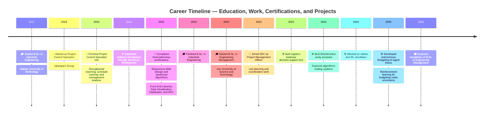

## Option 1.4 — Refined timeline with icons and duration milestones

Legend: 🎓 Education | 💼 Work | 📜 Certifications | ⚒️ Projects

```mermaid
timeline
    title Career Timeline — Education, Work, Certifications, and Projects
    2017 : 🎓 Started B.Sc. in Industrial Engineering
         : Isfahan University of Technology
    2019 : 💼 Started as Project Control Specialist
         : Jahanpars Group
    2020 : 💼 Finished Project Control Specialist role
         : Strengthened reporting, schedule tracking, and management analysis
    2021 : ⚒️ Expanded software foundations through self-driven development
    2022 : 📜 Completed freeCodeCamp certifications
         : Responsive Web Design and JavaScript Algorithms
         : Front End Libraries, Data Visualization, Databases, and APIs
    2023 : 🎓 Finished B.Sc. in Industrial Engineering
    2023 : 🎓 Started M.Sc. in Engineering Management
         : Iran University of Science and Technology
    2023 : 💼 Joined IEIC as Project Management Officer
         : Led planning and coordination work
    2023 : ⚒️ Built logistics heatmap decision-support tool
    2024 : ⚒️ Built RAG4Konkur study assistant
         : Explored algorithmic trading systems
    2024 : ⚒️ Worked on robotic arm RL simulation
    2025 : ⚒️ Developed Autonomous Budgeting AI Agent thesis
         : Reinforcement learning for budgeting under uncertainty
    2026 : 🎓 Expected completion of M.Sc. in Engineering Management
```