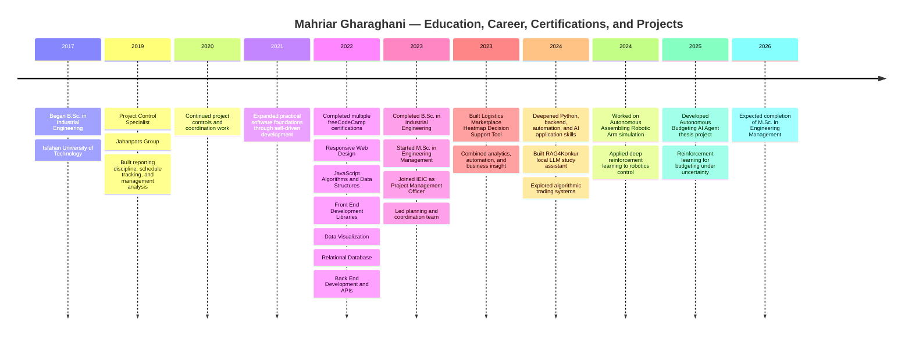
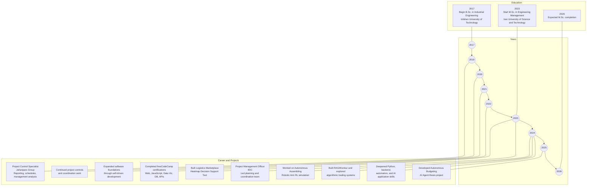
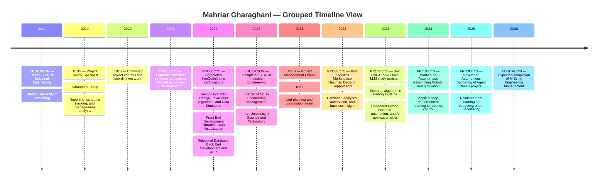
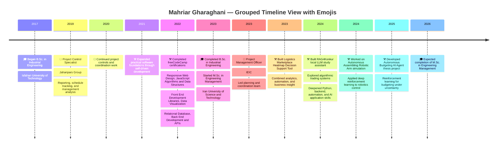
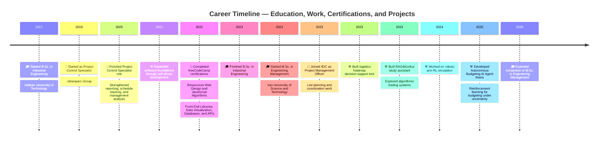
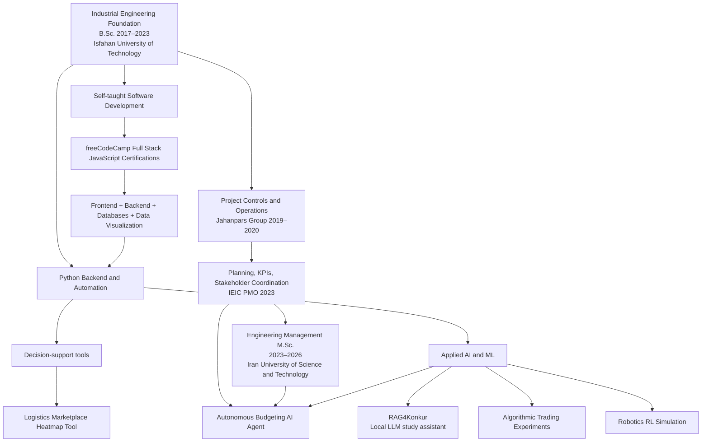
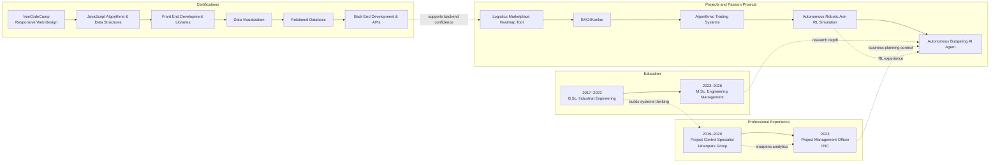
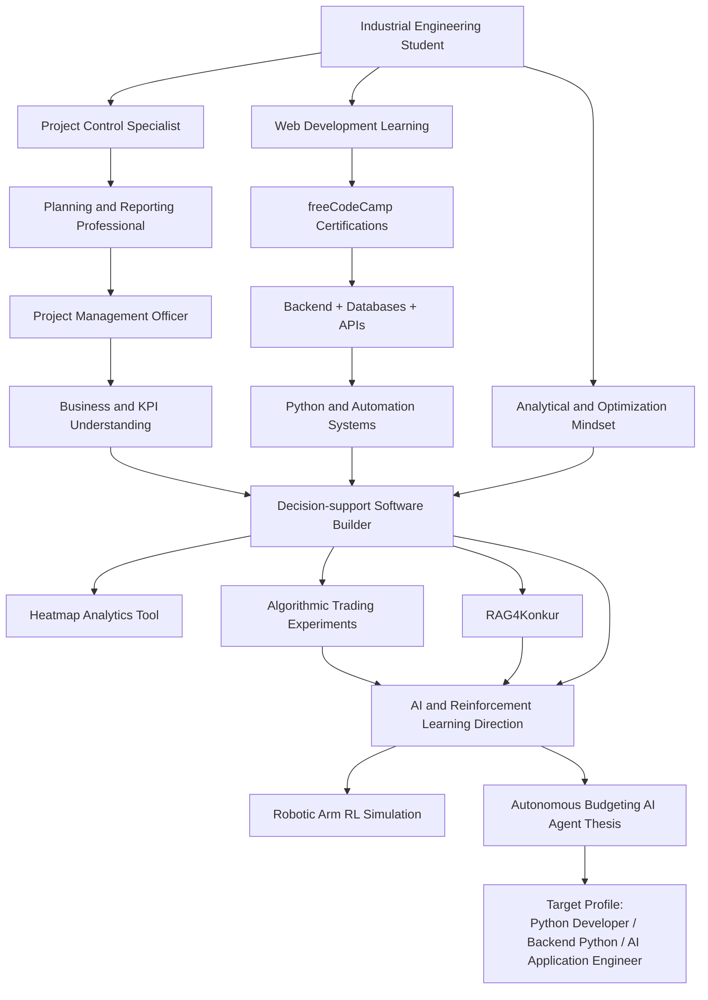
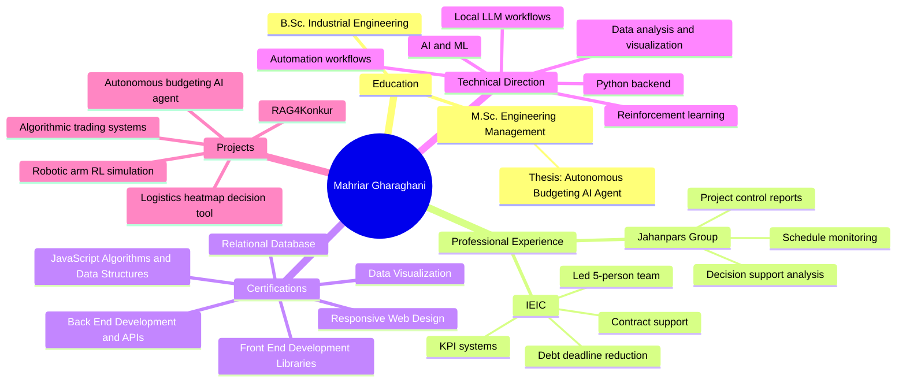

# Career Progression Diagram Options

Below are multiple diagram styles based on `applicationSystem/PYDEV.md`, so you can choose the one that best represents your story.

## Option 1 — Clean chronological timeline

## Option 1.1 — Split timeline with education above

## Option 1.2 — Timeline with grouped story lanes

## Option 1.3 — Timeline with emoji-grouped story lanes

## Option 1.4 — Refined timeline with icons and duration milestones

Legend: 🎓 Education | 💼 Work | 📜 Certifications | ⚒️ Projects

## Option 2 — Career transition flowchart

## Option 3 — Parallel life tracks timeline

## Option 4 — Story arc from operations to AI engineer

## Option 5 — Compact roadmap with grouped milestones

## Recommended picks

- **Best for resumes / portfolios:** Option 1
- **Best for showing career transitions:** Option 2
- **Best for showing everything at once:** Option 3
- **Best for personal-brand storytelling:** Option 4
- **Best for quick visual summary:** Option 5

## Notes

- Some projects in `PYDEV.md` were not tied to exact dates, so they are placed in a logical progression rather than a verified calendar year.
- If you want, I can next turn one of these into a **polished final version** with better styling, shorter labels, Persian year references, or a version optimized for GitHub Markdown rendering.
